# Progress — Language Learning App 🌍

An interactive mobile application for learning foreign languages. Built with Flutter, inspired by the Duolingo experience.

> 📺 **Demo:** [t.me/tolibtalmobile](https://t.me/tolibtalmobile)

---

## ✨ Features

- ❤️ **Lives system** — lose hearts on wrong answers, just like Duolingo
- 🔥 **Daily streak** — track your learning consistency every day
- 📊 **Level tests** — structured lessons from A1 to A2
- 📚 **Word cards** — searchable vocabulary with categories:
  - Grammar · Differences · Thesaurus · Collocations · Metaphors · Speaking
- 🔐 **Firebase Auth** — phone number + OTP authentication
- 🌙 **Dark / Light theme**
- 🌐 **Multilingual UI** — powered by easy_localization

---

## 🛠 Tech Stack


| Layer | Technology |
|-------|-----------|
| UI Framework | Flutter + Dart |
| State Management | Provider |
| Navigation | GoRouter |
| Local Database | SQLite (sqflite) |
| Local Storage | Hive |
| Cloud & Auth | Firebase Auth + Cloud Firestore |
| Localization | easy_localization |

---

## 📸 Screenshots

| | | |
|:---:|:---:|:---:|
| 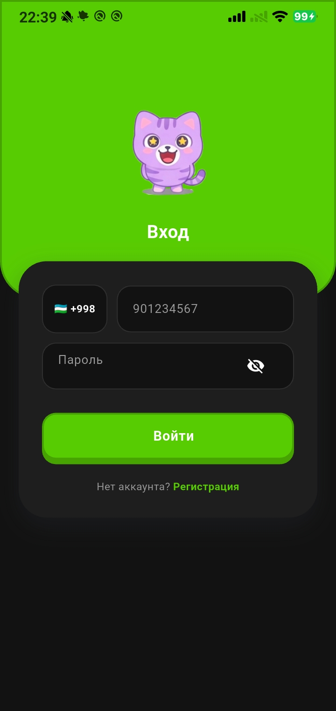 | 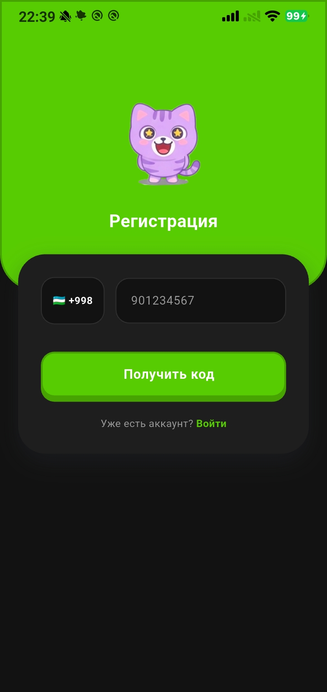 | 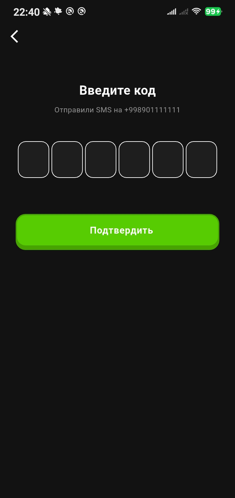 |
| 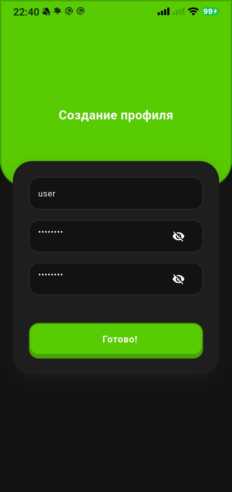 | 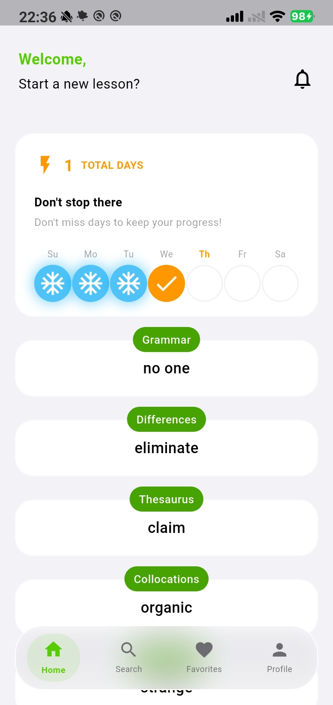 | 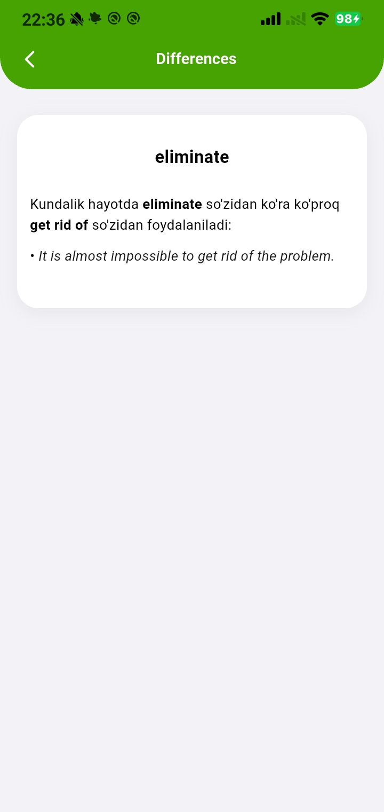 |
| 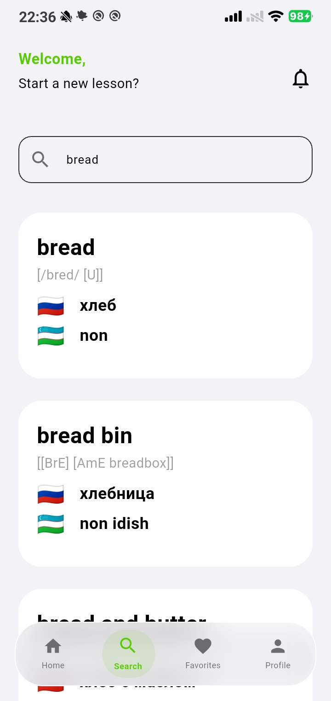 | 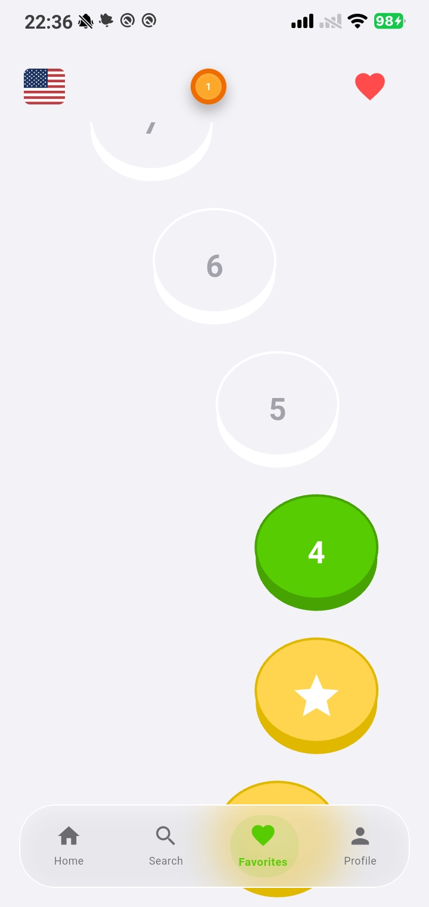 | 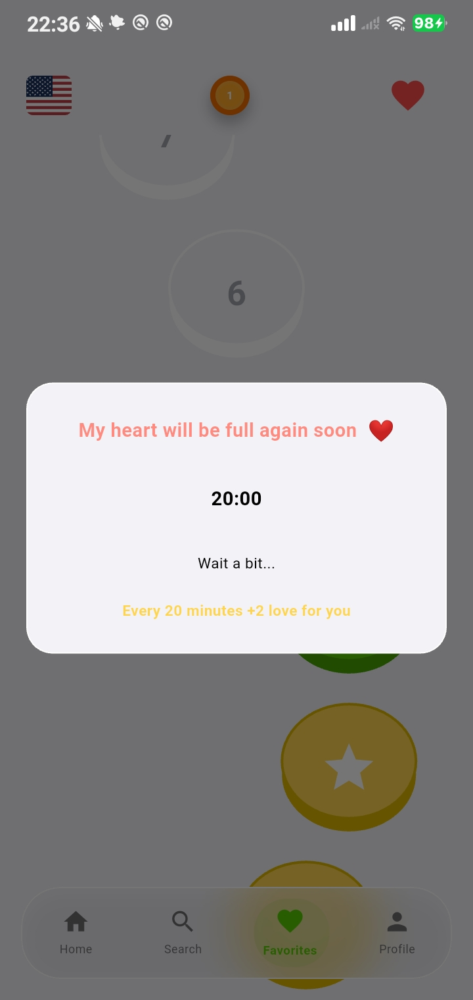 |
| 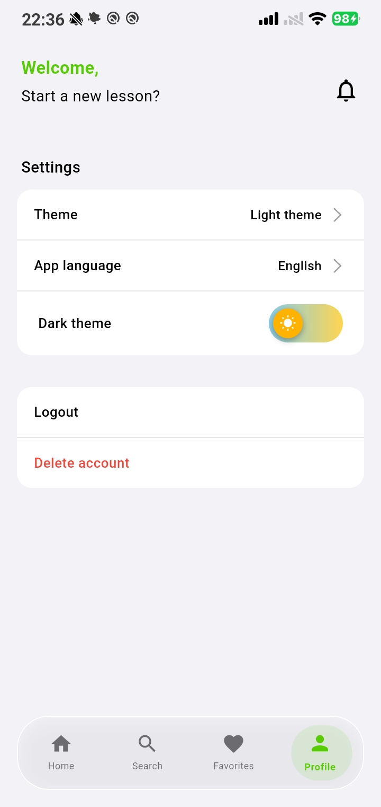 | 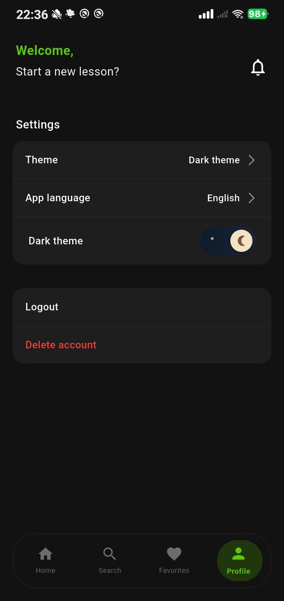 | 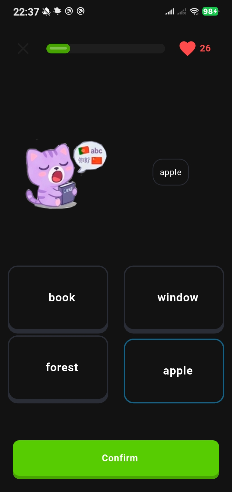 |
| 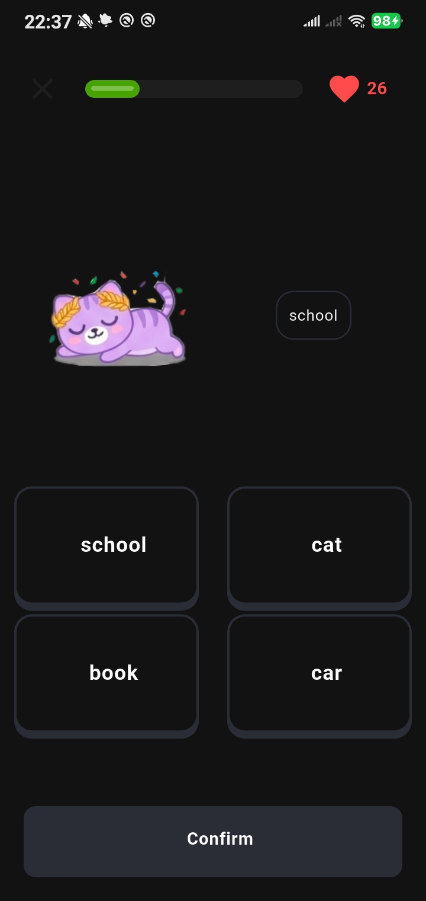 | | |

## 🚀 Getting Started

### Prerequisites

- Flutter SDK `^3.9.0`
- Dart SDK
- Android Studio or VS Code

### Run locally

```bash
git clone https://github.com/taltolib/progress_app.git
cd progress_app
flutter pub get
flutter run
```

### Test credentials

You can log in with the following test account:

| Field | Value |
|-------|-------|
| Phone | `+998 00 100 01 01` |
| OTP code | `010101` |

---

## 📁 Project Structure

```
lib/
├── core/
│   ├── providers/     # App state (auth, game, theme...)
│   ├── navigation/    # GoRouter setup
│   ├── database/      # SQLite service
│   └── firebase/      # Firebase config
├── domain/
│   ├── models/        # Data models
│   └── enums/         # App enums
├── features/          # Screens (home, login, game...)
└── shared/
    └── widget/        # Reusable UI components
```

---

## 👤 Author

**taltolib** — Junior Flutter Developer

[](https://github.com/taltolib)
[](https://t.me/tolibtalmobile)
